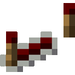
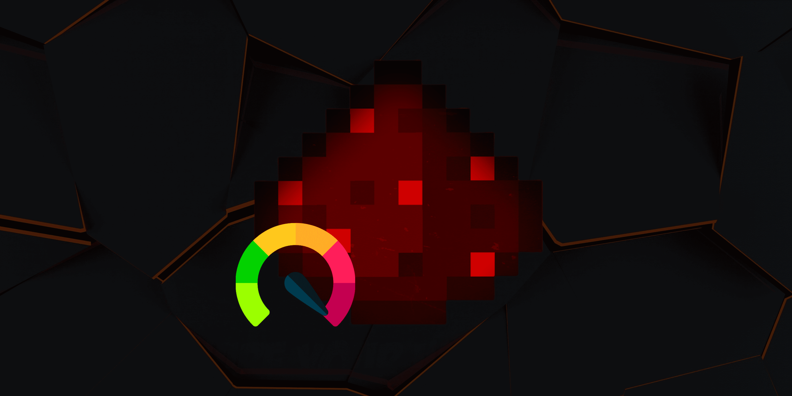

# MayRedstone Compiler Block List

The goal of this project is to optimize redstone and process it on CUDA Kernel to speeds which are largely considered impossible by using compiler techniques inspired by LLVM.

# Block List
<details><summary>List</summary>
<p>

# Blocks
| Image                                    | Block       | Cuda | States                                                                                                                                      |
|------------------------------------------|-------------|------|---------------------------------------------------------------------------------------------------------------------------------------------|
|   | Void        | 0    |                                                                                                                                               | 
|  | Solid       | 1    |   |
|  | Transparent | 2    |                                                                       |

## Redstone

### Power Sources [Step 1]


| Image                                                              | Block          | Cuda | States                                                                                                                                      |
|--------------------------------------------------------------------|----------------|------|---------------------------------------------------------------------------------------------------------------------------------------------|
|  | Redstone Block | 100  |                                                                         |
|  | Redstone Torch | 101  |   |
|           | Lever          | 102  |   |
|          | Button         | 103  |   |
|  | Pressure Plate | 104  |   |

### Wiring [Step 2]

| Image                                                             | Block               | Cuda | States                                                                                                                                                                                                                                                                                      |
|-------------------------------------------------------------------|---------------------|------|---------------------------------------------------------------------------------------------------------------------------------------------------------------------------------------------------------------------------------------------------------------------------------------------|
|        | Redstone Dust       | 200  |                                                                        |
|    | Redstone Reapeater  | 210  |         |
|  | Redstone Comperator | 220  |         |

### Run [Step 3]

| Image                                                             | Block         | Cuda | States                   |
|-------------------------------------------------------------------|---------------|------|--------------------------|
|        | Redstone Lamp | 300  |   |


</p>
</details>

# Stages

The compilation progresss will be split into stages as follows

1. Set the powered states in the `GPU Allocation Memory`
2. Process base `Inputs` like Buttons or Plates ... and set Block powered state through `CUDA Kernel`
3. Run the `Wiring Kernel` 15 times to process dust strength
4. Run the `Base Compiler Kernel` to process redstone devices


## Generation of the weighted directed graph

Firstly, a list of all redstone components in area will need to be created. This can be done easily by iterating through all blocks in the region and checking if they are potential components. Each component will be a node.

The links can be found by running a breadth first search starting from each input of the components. The weight will the be distance between the two componenets in signal strength.

### Example




This is a real graph generated by the current MCHPRS redpiler implementation.
As you can see, each redstone wire is a leaf node. The weights represent the distance from the source of the power.

## Logic optimization

TODO

## Generation of intermediate representation

TODO

## Native Code generation

TODO

Each node will generate 2 functions: update and tick. Each node will have a global memory location holding their state.
Example of generated code in C form:
```c
struct State {
    // Information such as powered or output strength
}
struct State n0;
void n0_update() {
    // ...
}
void n0_tick() {
    // ...
}
```