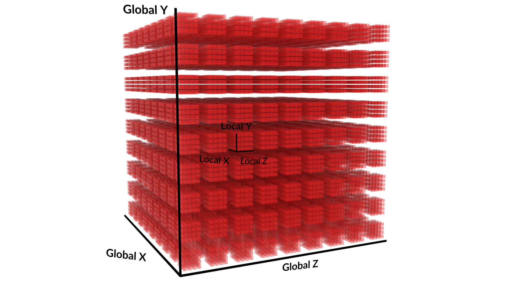

# MayRedstone Compiler

The goal of this project is to optimize redstone and process it on CUDA Kernel to speeds which are largely considered impossible by using compiler techniques inspired by LLVM.

# In-memory representation

Redstone circuits can be represented in a Grid to process it in parallel.
And sees Blocks as Number states [Block List](../List/BlockList.md)


The compilation progresss will be split into stages as follows:

1. Set the powered states in the `GPU Allocation Memory`
2. Process base `Inputs` like Buttons or Plates ... and set Block powered state through `CUDA Kernel`
3. Run the `Wiring Kernel` 15 times to process dust strength
4. Run the `Base Compiler Kernel` to process redstone devices


### Example




## Logic optimization

TODO

## Generation of intermediate representation

TODO

## Native Code generation

TODO

Each node will generate 2 functions: update and tick. Each node will have a global memory location holding their state.
Example of generated code in PTX form:
```ptx
//
// Generated by NVIDIA NVVM Compiler
//
// Compiler Build ID: CL-31968024
// Cuda compilation tools, release 12.0, V12.0.76
// Based on NVVM 7.0.1
//

.version 8.0
.target sm_52
.address_size 64

	// .globl	addArrays

.visible .entry addArrays(
	.param .u64 addArrays_param_0,
	.param .u64 addArrays_param_1,
	.param .u64 addArrays_param_2,
	.param .u32 addArrays_param_3
)
{
	.reg .pred 	%p<2>;
	.reg .b32 	%r<9>;
	.reg .b64 	%rd<11>;


	ld.param.u64 	%rd1, [addArrays_param_0];
	ld.param.u64 	%rd2, [addArrays_param_1];
	ld.param.u64 	%rd3, [addArrays_param_2];
	ld.param.u32 	%r2, [addArrays_param_3];
	mov.u32 	%r3, %ntid.x;
	mov.u32 	%r4, %ctaid.x;
	mov.u32 	%r5, %tid.x;
	mad.lo.s32 	%r1, %r3, %r4, %r5;
	setp.ge.s32 	%p1, %r1, %r2;
	@%p1 bra 	$L__BB0_2;

	cvta.to.global.u64 	%rd4, %rd1;
	mul.wide.s32 	%rd5, %r1, 4;
	add.s64 	%rd6, %rd4, %rd5;
	cvta.to.global.u64 	%rd7, %rd2;
	add.s64 	%rd8, %rd7, %rd5;
	ld.global.u32 	%r6, [%rd8];
	ld.global.u32 	%r7, [%rd6];
	add.s32 	%r8, %r6, %r7;
	cvta.to.global.u64 	%rd9, %rd3;
	add.s64 	%rd10, %rd9, %rd5;
	st.global.u32 	[%rd10], %r8;

$L__BB0_2:
	ret;

}
```